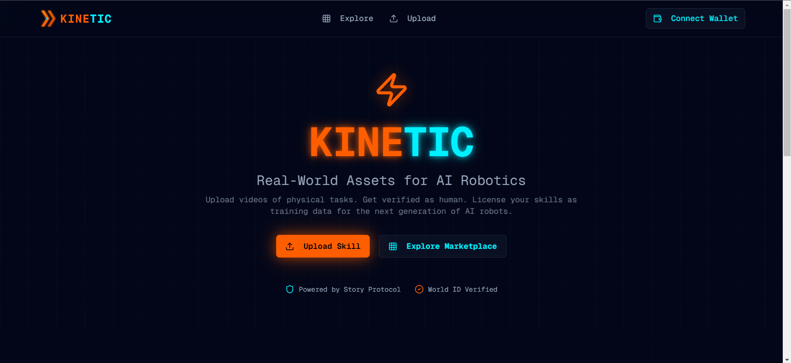
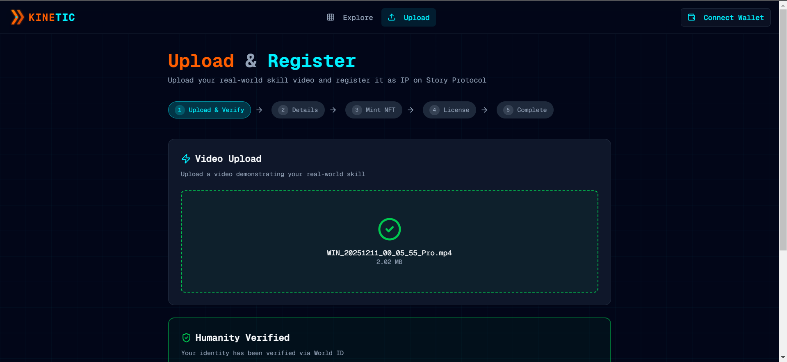
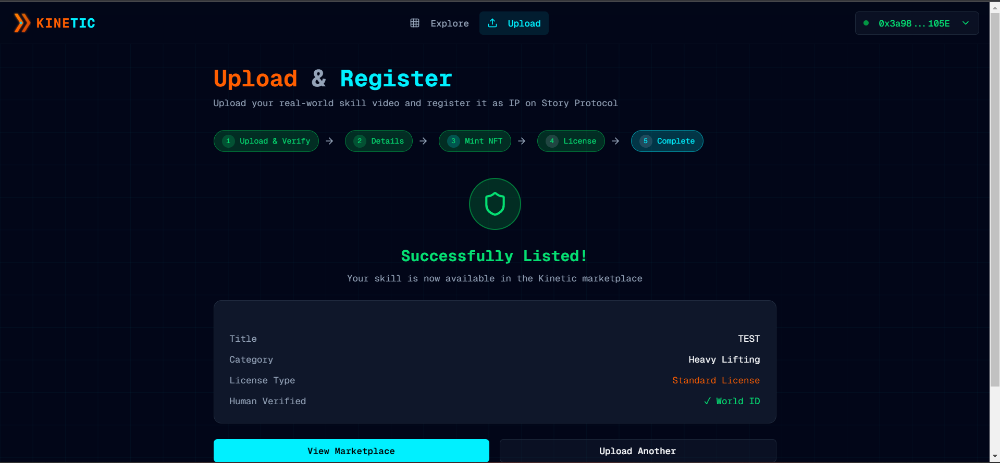
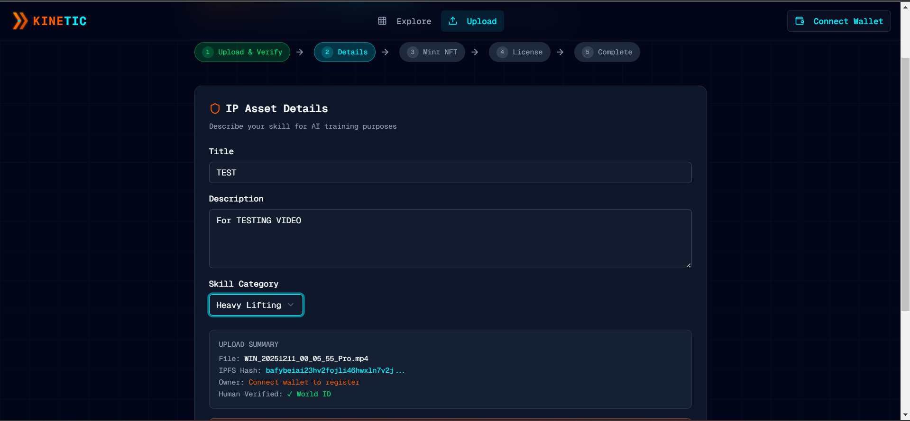

<div align="center">

# ⚡ KINETIC

### Real-World Assets for AI Robotics

[](https://story.foundation)
[](https://nextjs.org)
[](https://typescriptlang.org)
[](https://worldcoin.org)
[](LICENSE)

**A decentralized marketplace where humans upload videos of physical tasks to be licensed as training data for AI robots.**

[🚀 Live Demo](https://kinetic-rwa.vercel.app) • [📖 Documentation](#-getting-started) • [🎥 Demo Video](https://youtube.com)

---

</div>

## 📸 Screenshots

<div align="center">

|             Landing Page             |         Upload & Registration          |
| :----------------------------------: | :------------------------------------: |
|  |  |

|          License Configuration          |           Complete Flow            |
| :-------------------------------------: | :--------------------------------: |
|  |  |

|           Details Page           |
| :------------------------------: |
|  |

</div>

---

## 🎯 Problem Statement

The AI robotics industry faces a critical challenge: **training humanoid robots requires massive datasets of real human movements**, but there's no fair, transparent way for humans to monetize their physical skills as training data.

**KINETIC solves this by:**

- 🔐 Verifying human authenticity via **World ID** (proof of personhood)
- 📜 Registering skills as **IP Assets** on Story Protocol
- 💰 Enabling transparent **licensing & royalty payments**
- 🤖 Connecting verified human data with AI robotics companies

---

## ✨ Key Features

<table>
<tr>
<td width="50%">

### 🎬 Upload & Verify

- **Video Upload**: Store skill demos on IPFS (Pinata)
- **World ID**: Cryptographic proof you're human
- **Story Protocol**: Register as on-chain IP Asset
- **NFT Minting**: Each skill becomes tradeable NFT

</td>
<td width="50%">

### ⚖️ License Configuration

- **Standard License**: Royalty-based (adjustable %)
- **AI Training License**: Flat USDC fee for commercial use
- **PIL Terms**: Programmable IP License enforcement
- **Automatic Royalties**: Smart contract distribution

</td>
</tr>
<tr>
<td width="50%">

### 🛒 Data Marketplace

- **Browse Skills**: Grid of verified human skills
- **Trust Badges**: "Verified Human" + "Story IP"
- **Category Filters**: Fine Motor, Heavy Lifting, etc.
- **One-Click License**: Instant purchase for training

</td>
<td width="50%">

### 🔗 Blockchain Integration

- **Story Protocol Aeneid**: IP registration & licensing
- **Chain ID 1315**: Story Aeneid Testnet
- **wagmi + viem**: Modern Web3 stack
- **MetaMask/WalletConnect**: Multi-wallet support

</td>
</tr>
</table>

---

## 🏗️ Architecture

```
┌─────────────────────────────────────────────────────────────────────┐
│                           KINETIC                                    │
├─────────────────────────────────────────────────────────────────────┤
│                                                                      │
│  ┌──────────────┐    ┌──────────────┐    ┌──────────────┐           │
│  │   Frontend   │    │   Backend    │    │  Blockchain  │           │
│  │   Next.js    │◄──►│   API Routes │◄──►│    Story     │           │
│  │   React      │    │   Supabase   │    │   Protocol   │           │
│  └──────────────┘    └──────────────┘    └──────────────┘           │
│         │                   │                   │                    │
│         ▼                   ▼                   ▼                    │
│  ┌──────────────┐    ┌──────────────┐    ┌──────────────┐           │
│  │   World ID   │    │    IPFS      │    │  PIL License │           │
│  │ Verification │    │   Pinata     │    │   Module     │           │
│  └──────────────┘    └──────────────┘    └──────────────┘           │
│                                                                      │
└─────────────────────────────────────────────────────────────────────┘
```

---

## 🛠️ Tech Stack

<div align="center">

| Layer | Technology                   | Purpose                         |
| :---: | :--------------------------- | :------------------------------ |
|  ⚛️   | **Next.js 16**               | React framework with App Router |
|  🎨   | **Tailwind CSS + Shadcn/UI** | Modern UI components            |
|  🔷   | **TypeScript**               | Type-safe development           |
|  ⛓️   | **wagmi + viem**             | Ethereum interactions           |
|  📜   | **Story Protocol**           | IP registration & licensing     |
|  🌍   | **World ID**                 | Proof of personhood             |
|  📦   | **IPFS (Pinata)**            | Decentralized storage           |
|  🗄️   | **Supabase**                 | Database & auth                 |

</div>

---

## 🔗 Smart Contracts

| Contract              | Address                                      | Network      |
| :-------------------- | :------------------------------------------- | :----------- |
| **KineticVideoNFT**   | `0x0d2AC658555aDa13E916B3163934A682D555e46A` | Story Aeneid |
| **IP Asset Registry** | `0x77319B4031e6eF1250907aa00018B8B1c67a244b` | Story Aeneid |
| **Licensing Module**  | `0x04fbd8a2e56dd85CFD5500A4A4DfA955B9f1dE6f` | Story Aeneid |
| **PIL Template**      | `0x2E896b0b2Fdb7457499B56AAaA4AE55BCB4Cd316` | Story Aeneid |

> 🔍 View on [Story Explorer](https://aeneid.storyscan.xyz/address/0x0d2AC658555aDa13E916B3163934A682D555e46A)

---

## 🚀 Getting Started

### Prerequisites

- Node.js 18+
- npm or yarn
- Supabase account
- Pinata account (for IPFS)

### Installation

```bash
# Clone the repository
git clone https://github.com/ROHIT8759/KINETIC.git
cd kinetic

# Install dependencies
npm install

# Set up environment variables
cp .env.example .env.local

# Start development server
npm run dev
```

Open [http://localhost:3000](http://localhost:3000) to view the app.

### Environment Variables

Create a `.env.local` file:

```env
# Story Protocol (Aeneid Testnet)
NEXT_PUBLIC_STORY_RPC_URL=https://aeneid.storyrpc.io
NEXT_PUBLIC_STORY_CHAIN_ID=1315
NEXT_PUBLIC_NFT_CONTRACT_ADDRESS=0x0d2AC658555aDa13E916B3163934A682D555e46A

# Supabase
NEXT_PUBLIC_SUPABASE_URL=your_supabase_url
NEXT_PUBLIC_SUPABASE_ANON_KEY=your_supabase_anon_key

# Worldcoin
NEXT_PUBLIC_WORLDCOIN_APP_ID=app_staging_xxx
NEXT_PUBLIC_WORLDCOIN_ACTION=verify-human

# IPFS (Pinata)
NEXT_PUBLIC_PINATA_GATEWAY=https://gateway.pinata.cloud
PINATA_JWT=your_jwt
```

<details>
<summary>📊 <b>Supabase Database Schema</b> (Click to expand)</summary>

```sql
-- Enable UUID extension
create extension if not exists "uuid-ossp";

-- Users table
create table public.users (
  id uuid default uuid_generate_v4() primary key,
  wallet_address text unique not null,
  world_id_nullifier text unique,
  is_verified boolean default false,
  created_at timestamp with time zone default now()
);

-- Videos table
create table public.videos (
  id uuid default uuid_generate_v4() primary key,
  title text not null,
  description text,
  skill_category text not null,
  video_ipfs_hash text not null,
  owner_address text not null,
  is_verified_human boolean default false,
  ip_id text,
  license_terms jsonb,
  created_at timestamp with time zone default now()
);

-- Indexes
create index videos_owner_idx on public.videos(owner_address);
create index videos_category_idx on public.videos(skill_category);
```

</details>

---

## 📁 Project Structure

```
kinetic/
├── 📄 package.json
├── 📄 next.config.ts
├── 📁 public/
│   ├── logo.svg
│   └── icon.svg
├── 📁 contracts/
│   └── KineticVideoNFT_Remix.sol
└── 📁 src/
    ├── 📁 app/
    │   ├── page.tsx              # 🏠 Landing
    │   ├── upload/page.tsx       # 📤 Upload Flow
    │   ├── explore/page.tsx      # 🛒 Marketplace
    │   └── api/                  # 🔌 API Routes
    ├── 📁 components/
    │   ├── ui/                   # 🎨 Shadcn Components
    │   ├── layout/               # 📐 Header, Footer
    │   ├── upload/               # 📹 Video Upload
    │   └── license/              # ⚖️ License Config
    ├── 📁 hooks/
    │   ├── useStoryProtocol.ts   # 📜 IP Registration
    │   ├── useNFTContract.ts     # 🎫 NFT Minting
    │   ├── useWorldID.ts         # 🌍 Verification
    │   └── useIPFS.ts            # 📦 IPFS Upload
    ├── 📁 providers/
    │   ├── Web3Provider.tsx      # ⛓️ Wallet
    │   └── MarketplaceProvider.tsx
    └── 📁 lib/
        ├── contracts.ts          # 📋 ABIs
        └── utils.ts              # 🔧 Helpers
```

---

## 🎨 Design System

<div align="center">

| Element              | Color     |                             Preview                             |
| :------------------- | :-------- | :-------------------------------------------------------------: |
| 🌑 **Background**    | `#020617` |  |
| 🧡 **Human/Orange**  | `#ff5e00` |  |
| 💙 **Protocol/Blue** | `#00f0ff` |  |
| ⚪ **Text Primary**  | `#f8fafc` |  |

**Typography**: Geist Mono (monospace)

</div>

---

## 🛣️ Roadmap

- [x] ⚡ Core platform development
- [x] 🔗 Story Protocol integration (Aeneid)
- [x] 🌍 World ID verification
- [x] 📦 IPFS storage (Pinata)
- [x] 🎫 NFT minting system
- [ ] 💳 Fiat on-ramp integration
- [ ] 📱 Mobile app (React Native)
- [ ] 🤖 AI company dashboard
- [ ] 📊 Analytics & reporting

---

## 🤝 Contributing

Contributions are welcome! Please read our contributing guidelines first.

```bash
# Fork the repository
# Create your feature branch
git checkout -b feature/amazing-feature

# Commit your changes
git commit -m 'Add amazing feature'

# Push to the branch
git push origin feature/amazing-feature

# Open a Pull Request
```

---

## 👥 Team

<div align="center">

|          Role          |     Name     |
| :--------------------: | :----------: |
|    🧑‍💻 **Developer**    |    Rohit     |
|     🎨 **Design**      | KINETIC Team |
| 📜 **Smart Contracts** | KINETIC Team |

</div>

---

## 📄 License

This project is licensed under the **MIT License** - see the [LICENSE](LICENSE) file for details.

---

<div align="center">

### 🏆 Built for [Story Protocol Hackathon](https://story.foundation)

[](https://story.foundation)
[](https://worldcoin.org)

---

**⚡ KINETIC - Where Human Skills Power AI Robots ⚡**

[🔝 Back to Top](#-kinetic)

</div>
